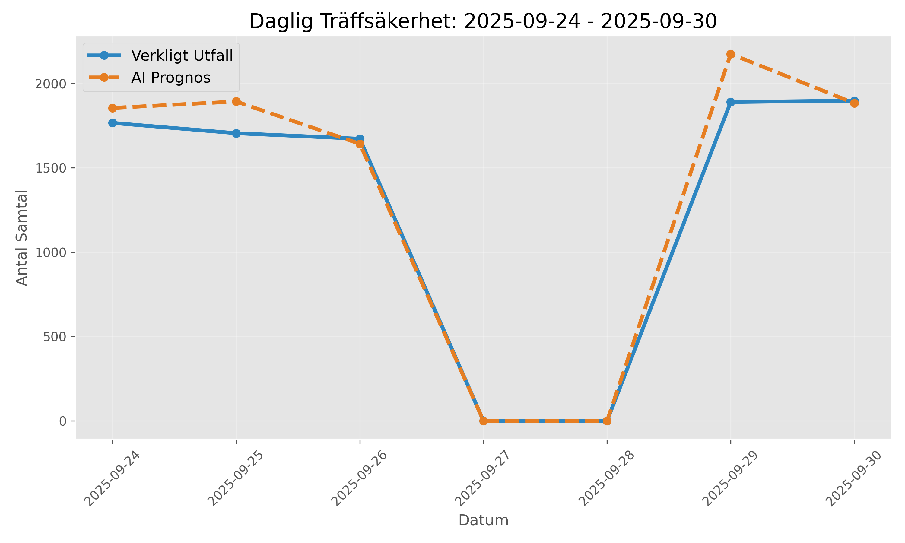

# 📞 Wecall Forecasting Pipeline: Operational AI for Staffing

> **From Insight to Foresight:** An end-to-end MLOps pipeline transforming raw contact center logs into actionable 14-day staffing forecasts with **~94% total volume accuracy**.

---

## 📖 Overview

This project addresses the critical challenge of operational staffing in a high-volume contact center. Moving beyond static averages, this system implements a **Risk-Aware Forecasting Engine** that predicts inbound call volumes and translates them directly into staffing minutes.

The solution is built on a robust **Medallion Architecture** (Bronze/Silver/Gold), ensuring data lineage, stability, and scalability.

### 🎯 Key Capabilities
* **Predictive Modeling:** Uses **LightGBM** with Recursive Forecasting to predict 14 days ahead.
* **Risk Quantification:** Outputs **Quantile Forecasts** (Low/Median/High) to visualize uncertainty/risk.
* **Behavioral Segmentation:** Uses **K-Means Clustering** to automatically group customers based on call intensity and AHT patterns.
* **Business Logic Integration:** Hard-coded filters for opening hours, holidays, and "True Redial" logic to filter noise.
* **Self-Healing Pipeline:** Automated scripts that handle data gaps and enforce fallback logic if the ML model detects anomalies.

---

## 🏗️ Architecture & Data Flow

The system follows a strict data engineering workflow to decouple analysis from transactional sources.

graph LR
    A[Source: MariaDB] -->|Job 0| B(Bronze Layer: Raw MSSQL)
    B -->|Job 1| C(Silver Layer: Cleaned & Features)
    C -->|Job 1.5| D(Customer Segmentation: K-Means)
    D -->|Job 2| E(Model Training: LightGBM)
    E -->|Job 3| F(Inference & Optimization)
    F -->|Job 4| G[Gold Layer: Actionable Forecast]

The Layers
Bronze (Raw): Immutable copy of source CDR (Call Detail Records) and Case data.

Silver (Refined): Cleaned data with "First-Touch Attribution" for transfers and strict Redial-filtering logic.

Gold (Aggregated): Business-ready tables including Frcast_Operative_Calls and Dim_Customer_Behavior.

📊 Results & Performance
The model is validated against a hold-out period using wMAPE (Weighted Mean Absolute Percentage Error) to prioritize high-volume accuracy.    

Metric,Result,Description
Total Volume Accuracy,~94.2%,Deviation of only +5.8% on weekly total.
Daily wMAPE,~20-30%,Captures daily rhythm and intra-day volatility.
Business Value,High,Enables proactive staffing 14 days in advance.

Visualizations
Below are examples of the generated forecast reports:

  
  

🛠️ Tech Stack
Language: Python 3.x

Core Libraries: pandas, numpy, sqlalchemy, lightgbm, scikit-learn

Database: Microsoft SQL Server (Data Warehouse), MariaDB (Source)

Orchestration: Batch Scripts (.bat) & Windows Task Scheduler

Visualization: Matplotlib (Reporting), Power BI (Dashboarding)

📂 Project Structure

├── 0_Load_Bronze_Data.py           # ETL: Ingests raw data from source
├── 1_Extract_Operative_Data.py     # ETL: Cleans data, handles Redials
├── 1.5_Run_Customer_Segmentation.py # ML: K-Means clustering of customers
├── 2_Train_Operative_Model.py      # ML: Trains LightGBM Quantile models
├── 3_Run_Operative_Forecast.py     # Inference: Generates 14-day forecast
├── 4_evaluate_forcast.py           # QA: Calculates wMAPE against actuals
├── 5_Generate_Report_visuals_final.py # Viz: Generates PNG graphs for reporting
├── config.py                       # Central configuration (Secrets & Rules)
├── DataDriven_utils.py             # Helper functions (Time features, Holidays)
├── requirements.txt                # Python dependencies
└── Run_daily_Forcast.bat           # Automation script

🚀 Getting Started
Prerequisites
Python 3.10+

SQL Server ODBC Driver 18

Access to source databases (configured in config.py)
Installation
Clone the repository
git clone [https://github.com/YOUR_USERNAME/wecall-forecasting-pipeline.git](https://github.com/YOUR_USERNAME/wecall-forecasting-pipeline.git)
cd wecall-forecasting-pipeline

Install dependencies
pip install -r requirements.txt

Configuration

Rename _TEST_config.py (if available) or create config.py.

Update database credentials in config.py.

Run the Pipeline To run the full daily flow:
Run_daily_Forcast.bat

Or run individual steps via Python:
python 3_Run_Operative_Forecast.py

📈 Future Improvements
Exogenous Variables: Incorporate weather data and marketing schedules.

Containerization: Dockerize the pipeline for cloud deployment (Azure/AWS).

API Integration: Serve forecasts via REST API instead of direct SQL insertion.

👩‍💻 Author
Lily Ibrahimi BI Analyst

Built as part of a thesis project on Data-Driven Operational Steering.
